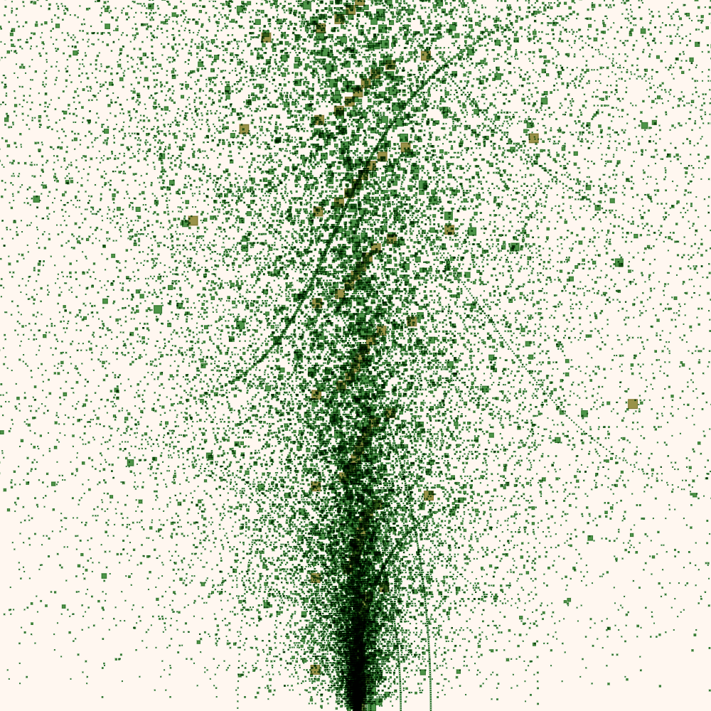

# ajnor

ajnor is an open-source creative-coding toolkit for JavaScript.

It is lightweight, functional and fast.
It allows you to create your starry nightsky in squint.

Currently the following commands are supported:
- Background (bg)
- Rectangle (rect)
- Circle (circle)
- Arcs (arc)
- Lines (line)
- Polygons (poly)
- Text (text)
- BlendMode (bm)



## Requirement
**ajnor** requires a browser that supports ECMAScript modules.

## How to use
ajnor is lightweight and modular and is written in modern JavaScript.

Use it directly by downloading it from [GitHub](https://github.com/birdboat00/ajnor):
```js
import { ... } from "/path/to/ajnor/mod.mjs"
```

or import it from jsDelivr:
```js
import { ... } from "https://cdn.jsdelivr.net/gh/birdboat00/ajnor/src/mod.mjs"
```

Draw a rectangle:
```js
import * as a from "../src/mod.mjs"

a.defsketch({
  size: a.szsquare(400),
  parent: "example",
  view: (cv) => {
    a.plot(cv, a.pipe(a.makePen())
      .to(a.bg, { color: a.colblack() })
      .to(a.rect, { x: 20, y: 20, w: 360, h: 360, color: a.colwhite() }).value
    )
  }
})
```

## Disclaimer
I just started working on this library and there is still a lot of work to
be done. Feel free to help out!

## License
ajnor is licensed under the MIT license.
